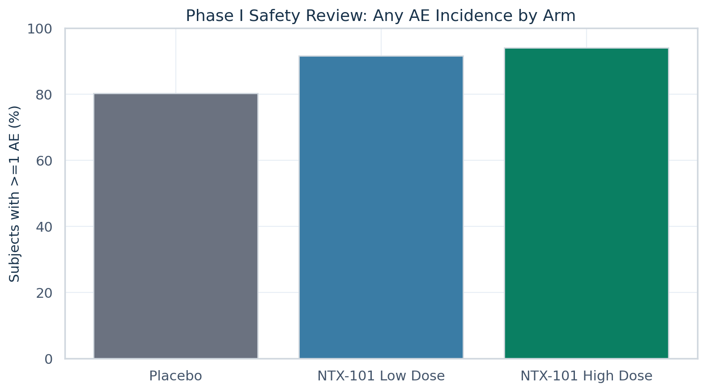
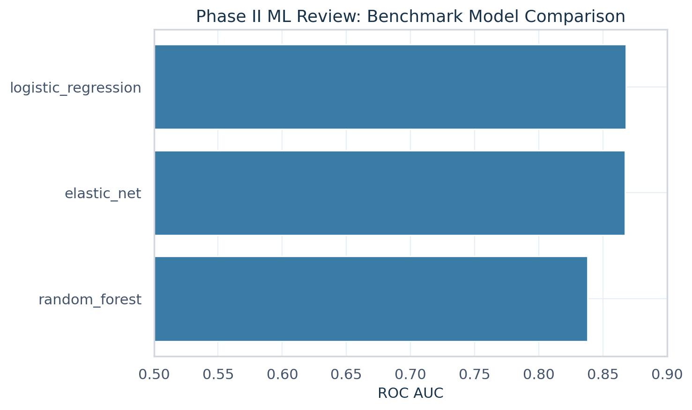
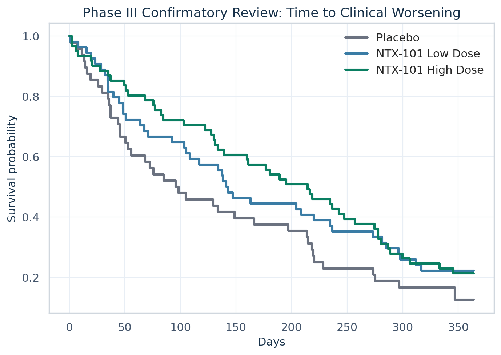

# Clinical Development Portfolio — NTX-101 / NTX-101

> Python-first sponsor-style clinical data science portfolio simulating an Alzheimer’s development program from **Phase I to Phase III** using **CDISC-shaped public structure**, a **bounded synthetic continuity bridge**, **ADaM-like derivations**, **formal treatment comparisons**, **interpretable ML benchmarking**, and **static executive reporting**.

[](#environment-setup)
[](#hybrid-stack)
[](#what-this-repository-shows)
[](#standards-and-data-lineage)

## Executive snapshot

- **Program:** `NTX-101`
- **Asset:** `NTX-101` — fictional investigational therapy used to create a believable, portfolio-safe development narrative
- **Indication:** mild-to-moderate Alzheimer’s dementia
- **Source strategy:** public backbone + synthetic bridge
- **Workflow:** raw XPT/RDA -> interim parquet -> harmonized SDTM-like -> synthetic continuity -> ADaM-like -> gated reports
- **Phase I gate:** **GO**
- **Phase II gate:** **GO**
- **Phase III conclusion:** GO with simulated superiority on the primary time-to-event analysis
- **Primary ML model:** interpretable logistic regression with benchmark comparators
- **Validation:** tests, lint, lineage manifest, and final QC artifacts generated

## Open the portfolio reports

### Main report
- **[Final executive HTML report](docs/final_report/index.html)**

### Phase reports
- [Phase I safety review](docs/phase1/index.html)
- [Phase II endpoint and interpretable ML review](docs/phase2/index.html)
- [Phase III confirmatory review](docs/phase3/index.html)

### Supporting pages
- [Portfolio landing page](docs/index.html)
- [Program overview](docs/program_overview/index.html)
- [Data lineage page](docs/data_lineage/index.html)
- [Model card page](docs/model_cards/index.html)

## What this repository shows

This project is designed like a **small sponsor-style clinical development analytics program**:

- **clinical development narrative continuity** across Phase I, II, and III
- **CDISC / SDTM / ADaM-style thinking** visible in the repo structure
- **data lineage and QC** from raw inputs to stakeholder-facing outputs
- **formal treatment comparisons** with p-values and effect summaries where appropriate
- **decision gates** instead of isolated descriptive plots
- **interpretable ML** used in a clinically relevant Phase II context
- a **thin R reference layer** that reflects real biopharma practice without displacing Python-first ownership

This is explicitly **portfolio simulation work from public sources** — not sponsor production work, not GxP validated, and not regulatory submission evidence.

## Why NTX-101 is fictional

The current public backbone includes source structure associated with real-world-style treatment labels. To avoid implying any claim about an actual development asset, the program now uses **NTX-101**, a fictional investigational therapy.

That choice improves the portfolio in three ways:
- allows a **believable but controlled** efficacy/safety profile
- avoids conflict with **known historical outcomes** of real compounds
- keeps the scientific story honest while preserving **industry realism**

## Key outcomes by phase

| Phase | Main question | Result |
|---|---|---|
| Phase I | Is early safety acceptable for continued clinical development? | **GO** — manageable safety burden, no treatment-related death imbalance, formal comparison retained |
| Phase II | Is there enough efficacy signal to justify confirmatory development? | **GO** — formal Week 24 signal with plausible responder separation, tuned threshold logic, and good benchmarked ML discrimination |
| Phase III | Does the integrated efficacy/safety narrative support advancement? | **GO** — simulated superiority with log-rank p-value < 0.05, hazard ratio below 1.0, and dose-supported delay to worsening |

## Portfolio highlights

### 1) Standards-aware source handling
- **12 CDISC Pilot XPT domains** normalized into parquet
- **32 SafetyData RDA objects** exported into parquet
- raw -> interim -> harmonized -> derived lineage explicitly tracked
- thin R reference derivations used to cross-check selected outputs

### 2) Harmonization and derivation workflow
- harmonized SDTM-like layer for `DM`, `AE`, `LB`, `VS`, `EX`, `DS`
- deterministic synthetic continuity bridge for:
  - subject master
  - phase assignments
  - longitudinal efficacy
  - time-to-worsening event outcomes
- ADaM-like outputs for:
  - `ADSL`
  - `ADAE`
  - `ADLB`
  - `ADVS`
  - `ADEFF`
  - `ADTTE`

### 3) Formal clinical-trial-style reporting
The repo includes a professional statistical layer:
- treatment-vs-placebo comparisons
- p-values and effect summaries
- phase gate memos with explicit hypothesis framing
- benchmark model comparison rather than a single over-performing ML result
- pharma-style figures with ordered lines and executive color palette

### 4) Reporting built for hiring-manager review
- final HTML executive report for quick scanning
- phase-level HTML reports
- data lineage page
- model card page
- visuals embedded in the README for fast portfolio assessment

## Example visuals

### Phase I — AE incidence by arm


### Phase II — benchmark model comparison


### Phase III — Kaplan–Meier time to worsening


## Standards and data lineage

The repository is deliberately structured around recognizable clinical analytics layers:

```text
raw external data (.xpt, .rda)
  -> interim normalized parquet
  -> harmonized SDTM-like domains
  -> synthetic continuity bridge
  -> ADaM-like analysis datasets
  -> phase reports / model card / final executive report
```

Core lineage and QC artifacts:
- `artifacts/lineage/lineage_manifest.csv`
- `metadata/provenance_map.csv`
- `artifacts/qc/ingestion_summary.json`
- `artifacts/qc/schema_validation_summary.json`
- `artifacts/qc/harmonization_summary.json`
- `artifacts/qc/adam_qc_summary.json`
- `artifacts/qc/final_validation_report.md`

## Modeling posture

The Phase II ML section was intentionally revised to be more realistic and less “too good to be true”.

### Current approach
- **Primary model:** logistic regression
- **Benchmark models:** elastic net logistic regression, random forest
- **Reason primary stays logistic regression:** interpretability, coefficient transparency, and stronger alignment with sponsor-side review expectations

### Why that matters
In clinical development analytics, the best portfolio signal is usually not “I found the strongest possible black box.”
It is “I know how to balance interpretability, leakage control, development context, and decision usefulness.”

## Hybrid stack

### Python-first
Python owns:
- ingestion orchestration
- validation and schema checks
- harmonization
- synthetic continuity generation
- ADaM-like derivation
- phase analytics
- statistical summaries
- survival analysis
- benchmarked interpretable ML
- HTML report generation

### R-assisted
R remains intentionally narrow:
- `.rda` export support
- reference ADSL / ADAE derivation scripts
- Python-vs-R comparison artifacts

This reflects a realistic biopharma posture: **Python is primary**, while **R appears where standards credibility is useful**.

## Repository structure

```text
.
├── README.md
├── pyproject.toml
├── Makefile
├── config/
├── data/
├── docs/
├── artifacts/
├── metadata/
├── project/
├── r/
├── src/
└── tests/
```

## Environment setup

### Python
```bash
python -m venv .venv
source .venv/bin/activate
pip install -e .[dev,reports]
```

### R layer
```bash
Rscript install_r_packages.R
```

### Quick validation
```bash
make validate
pytest -q
ruff check .
```

### Data Download

Linux:
```bash
chmod +x download_clinical_data.sh
./download_clinical_data.sh
```

Windows (PowerShell):
```powershell
.\download_clinical_data.bat
```

## Rebuild the portfolio outputs

```bash
PYTHONPATH=src python -m clinical_trials.ingest.pipeline
PYTHONPATH=src python -m clinical_trials.validation.run_schema_validation
PYTHONPATH=src python -m clinical_trials.harmonize.harmonize_domains
PYTHONPATH=src python -m clinical_trials.synthetic.pipeline
PYTHONPATH=src python -m clinical_trials.derive.pipeline
PYTHONPATH=src python -m clinical_trials.analysis.run_phase1
PYTHONPATH=src python -m clinical_trials.modeling.run_phase2
PYTHONPATH=src python -m clinical_trials.analysis.run_phase3
Rscript r/derive_adsl_reference.R
Rscript r/derive_adae_reference.R
PYTHONPATH=src python -m clinical_trials.validation.compare_r_python
PYTHONPATH=src python -m clinical_trials.reporting.build_site
```

## What this portfolio-project shows:

- sponsor-style phase progression
- standards-aware clinical structure
- traceable derivations
- inferential analysis in context
- executive gate memos
- interpretable ML inside a development workflow


## Honesty statement

This repository is a **public portfolio project** built from public structural examples and synthetic continuity logic. It does **not** claim:
- sponsor production status
- GxP validation
- FDA readiness
- causal or regulatory-grade inference

## Keywords

clinical development, clinical trial analytics, clinical data science, BioPharma, CDISC, SDTM, ADaM, survival analysis, time-to-event, safety analytics, endpoint modeling, interpretable ML, patient-level trial data, regulated analytics
